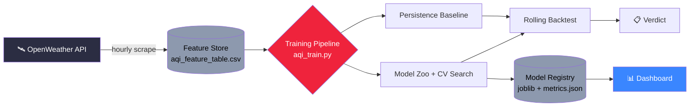

<div align="center">

# 🌫️ AQI Forecast

**Hourly air-quality forecasting for Lahore, PK — built to be honest about its own accuracy.**


</div>

---

## Architecture



**Pipeline stages**

| Stage | What happens |
|---|---|
| **Scraper** | Polls OpenWeather hourly for weather + pollutant readings, appends to the feature store |
| **Feature Store** | Flat CSV with raw readings, engineered lags/rolling means, and 1h/24h/72h forward targets |
| **Training** | Delta-target regression (predict *change*, not raw AQI) with leakage-safe feature selection |
| **Evaluation** | Persistence baseline + changed-rows breakdown + rolling-origin backtest — never a single trusted number |
| **Registry** | Every run's model, preprocessor, and metrics saved and versioned by timestamp |
| **Dashboard** | Visualizes AQI trend history, live forecast vs. actual, and backtest verdict over time |

---

## Models

Three tabular regressors, each tuned via `RandomizedSearchCV` over `TimeSeriesSplit`, competing on the same delta-target task:

| Model | Why it's here |
|---|---|
| 🌲 **XGBoost** | Captures nonlinear interactions between weather + pollutant features |
| 🌳 **Random Forest** | Regularization-friendly baseline, resistant to overfitting on small data |
| 📈 **Elastic Net** | Linear + sparse — a check against the tree models overfitting noise |

The winner is picked by RMSE (or by error on rows where AQI *actually changed*, once enough of those exist) — never assumed.

---

## Dashboard

A lightweight view over the model registry, showing:

- 📉 Recent AQI trend vs. 1h-ahead forecast
- ✅ Live comparison against the persistence baseline
- 🔁 Rolling backtest win-rate over time, so accuracy claims are always checkable at a glance

*(planned / in progress — surfaces the same `VERDICT` the CLI prints, as a chart instead of a log line)*

---

## Quick start

```bash
pip install pandas numpy scikit-learn xgboost joblib scipy
python aqi_train.py --feature-store-path data/feature_store/aqi_feature_table.csv
```

---

## Deploying the dashboard

The dashboard and API are separate services. Streamlit Community Cloud runs
`dashboard.py`, but it does not run `api_server.py` on the same machine.
Therefore, `http://127.0.0.1:8000` only works when the API is running locally.

1. Deploy this repository as a web service on a host such as Render, Railway,
   or Fly.io. Use the included `Dockerfile`, or start the service with:

   ```bash
   uvicorn api_server:app --host 0.0.0.0 --port $PORT
   ```

   The service must expose the repository files under `data/`, including
   `data/feature_store/` and `data/model_registry/`. Verify it responds at
   `https://<api-host>/health`.
2. In the Streamlit app settings, add the environment variable
   `AQI_API_URL=https://<api-host>` (no `/latest` suffix), then reboot the app.

For local development, start the API in one terminal and the dashboard in
another:

```bash
uvicorn api_server:app --host 127.0.0.1 --port 8000
streamlit run dashboard.py
```

Do not use `127.0.0.1` as `AQI_API_URL` in the deployed Streamlit app; it
refers to the Streamlit container itself, not your computer or the API host.

---

<div align="center">
<sub>Built with an unusual amount of paranoia about fooling itself.</sub>
</div>
